# Sandevistan — Multi-Agent RAG for Heavy-Equipment Manuals

An Azure-native, multi-agent Retrieval-Augmented Generation system that answers
technicians' questions over rotary-drill instruction manuals with **grounded,
citation-backed responses** — including the relevant manual diagrams.

Built end-to-end during my Software Engineering internship at **Sandvik Rock
Tools** (May–Jul 2026) and deployed to production on Azure Container Apps.

> **Public, sanitized snapshot.** Infrastructure identifiers, search-index
> schemas, deployment runbooks, and all manual-derived data have been removed;
> the system runs against private Azure resources, so there is no public demo.
> Shared for demonstration purposes — not licensed for reuse.

## Why this is not "just another RAG wrapper"

- **Controlled 11-node agent graph** (LangGraph) — a deterministic pipeline,
  not a free-running agent loop:

```mermaid
flowchart LR
    A[load_memory] --> B[input_guardrail]
    B --> C[query_understanding]
    C --> D[retrieval]
    D --> E[context_builder]
    E --> F[answer_generation]
    F --> G[grounding_critic]
    G --> H[revision]
    H --> I[safety_critic]
    I --> J[final_response]
    J --> K[save_memory]
```



- **Hallucination control on safety-critical content** — a grounding critic
  verifies every answer against the retrieved manual context, feeding exactly
  one controlled revision loop; a separate safety critic gates the final
  response.
- **Hybrid retrieval** — vector + semantic ranking over Azure AI Search, with
  multi-plan search execution and per-machine filtering.
- **Multimodal citations** — an image-retrieval agent resolves the diagrams
  referenced inside cited manual chunks, reranks them, and serves them through
  a blob-proxy endpoint, so answers can show the exact figure a technician
  needs.
- **Production engineering, not a notebook** — Azure OpenAI rate limiting with
  header-based backoff, a model router that assigns cheaper/stronger
  deployments per agent role, structured logging with request tracing and
  timing, pluggable conversation memory (Azure Table Storage or in-memory),
  and an evaluation runner for regression-testing answer quality.

## Stack

FastAPI · LangGraph · Azure OpenAI · Azure AI Search · Azure Table Storage ·
Azure Blob Storage · Streamlit · Docker / Azure Container Apps · pytest

## Repo layout

```
backend/
├── agents/          LLM agents: guardrail, query understanding, answer
│                    generation, grounding & safety critics, revision,
│                    image retrieval + model router & rate limiter
├── graph/           LangGraph workflow, node contracts, state
├── retrieval/       Azure AI Search + Azure OpenAI clients, search executor
├── context/         context building, citations, image reference resolution
├── memory/          conversation memory (Azure Table / in-memory)
├── observability/   structured logging, request context, timing
├── prompts/         per-agent system prompts
├── services/        health checks, image blob proxy
├── tests/           unit tests for the pure helpers
└── app.py           FastAPI application
frontend/streamlit_app.py    chat UI with citations and figures
docs/                architecture and requirements notes
scripts/             ingestion utilities and live-endpoint test probes
rag_eval_runner.py   evaluation harness (dataset kept private)
```

## Running it

You need your own Azure OpenAI and Azure AI Search resources:

```bash
pip install -r requirements.txt
cp .env.example .env        # fill in your endpoints, keys, and deployments
uvicorn backend.app:app --reload            # backend
streamlit run frontend/streamlit_app.py     # frontend
pytest backend/tests                        # unit tests (no Azure needed)
```

## Numbers

~12,000 lines of Python, 75 commits, designed/built/shipped in a 7-week
internship. Retrieval quality was evaluated against a curated Q&A dataset
derived from the manuals (kept private, along with all customer data).
